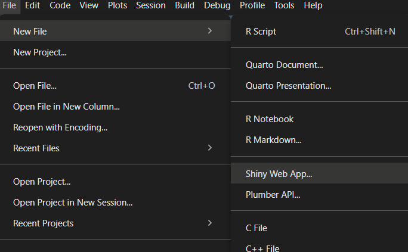

# R Shiny Overview

## What is R Shiny?


`shiny` is a powerful and flexible R package that makes it easy to build interactive web applications and dynamic dashboards straight from `R`. You can also use it in Python (language agnostic, Posit.com)

These apps can be hosted on a standalone webpage or embedded in R Markdown documents. Not only does `shiny` allow you to build these web apps from R, but it enables their construction using only R code. Knowledge of HTML and web development is not required at all, though it can be used to enhance your apps in numerous ways. 

### Create a new shiny app

To create a new R `shiny` App, simply go to **File** (or the **New File** icon) in the upper left corner of RStudio and select **Shiny Web App**.



`shiny` apps are unlike any other vehicle for R work that you’ve likely used before (unless you have experience with reactive programming. One of the first things to understand is that these applications consist of two primary components: a server and a user interface. When starting a new shiny application you’ll first be asked to specify three things:

- A name for the app
- Application type: single file (app.R) or multiple file (ui.R/server.R)
- Home directory for the app

```r
library(shiny)

runExample("01_hello")      # a histogram
runExample("02_text")       # tables and data frames
runExample("03_reactivity") # a reactive expression
runExample("04_mpg")        # global variables
runExample("05_sliders")    # slider bars
runExample("06_tabsets")    # tabbed panels
runExample("07_widgets")    # help text and submit buttons
runExample("08_html")       # Shiny app built from HTML
runExample("09_upload")     # file upload wizard
runExample("10_download")   # file download wizard
runExample("11_timer")      # an automated timer
```

### Deploying your app

`shiny` apps can be deployed in a few different ways.
- They can be run from their local files in the home directory 
- They can be hosted and run on a server at your organization (e.g. university)
- or they can even be hosted through RStudio (e.g. shinyapps.io).

## Examples

Time to look over some examples: 

- [Shiny](https://shiny.posit.co/)

- [Single file app](https://shiny.posit.co/r/gallery/start-simple/single-file-shiny-app/)
- [Clustering](https://shiny.rstudio.com/gallery/kmeans-example.html)
- [Rotten Tomatoes Explorer](https://shiny.rstudio.com/gallery/movie-explorer.html)
- [SuperZIP](https://shiny.posit.co/r/gallery/interactive-visualizations/superzip-example/)
- [Google Charts](https://shiny.posit.co/r/gallery/interactive-visualizations/google-charts/)
- [HTMLWidgets] (https://shiny.rstudio.com/gallery/)


# How have I used Shiny ?

## Teaching and Learning

**Interactive Assignments**: Shiny apps can be integrated into classroom activities, allowing students to explore statistical concepts through hands-on interaction.

**Lecture Supplements**: Shiny can be used to create dynamic visual aids that enhance understanding of complex topics during lectures.

## Data Visualization and Exploration

**Interactive Data Visualizations**: Shiny allows you to create visualizations that users can manipulate, such as adjusting parameters through sliders or selecting variables from dropdown menus.

**Real-time Data Analysis**: Shiny apps can be designed to perform analyses on-the-fly, providing immediate feedback based on user inputs.

## Deployment and Sharing

**Local and Remote Hosting**: Shiny apps can be run locally on your machine or deployed to servers like shinyapps.io, making them accessible to a wider audience.

**User Engagement**: By sharing Shiny apps, you enable users to engage with your data and analyses, fostering a deeper understanding of the subject matter.


## For example:

### Environment:
    MDT projects consisting of clinicians, clinical researchers, bio researchers, etc.

### The Issue:
    Exploring big data structures to develop new experimental directions with lack of knowledge of data structures, data analysis and latest information on approaches.

### A Solution:
    Develop a basic application, easily deployable that accesses data and presents results in a recognisable manner to allow researchers to quickly explore data

### The Solution:
`run_me.r`
 ```
# RNA-seq Expression Explorer: General organoid
# Nicholas Owen 2022-4, @github/nicholas-owen


id<-"1RzUiX4-fZkHPJorv_ZfgaX1J3MihOVyi"
source(sprintf("https://docs.google.com/uc?id=%s&export=download", id))
#shinyApp(ui = ui, server = server)
go()
```


### For publications

Richardson R, Owen N, Toms M, Young RM, Tracey-White D, Moosajee M. Transcriptome profiling of zebrafish optic fissure fusion. Sci Rep. 2019 Feb 7;9(1):1541. doi: [10.1038/s41598-018-38379-5](https://doi.org/10.1038/s41598-018-38379-5). PMID: [30733552](https://pubmed.ncbi.nlm.nih.gov/30733552/); PMCID: PMC6367446.

[Data Explorer](bit.ly/ZfOptic2018)


# Support
https://shiny.posit.co/

https://shiny.posit.co/r/gallery/

https://groups.google.com/g/shiny-discuss

# Bigger examples

https://brendenmsmith.com/projects/r%20shiny%20apps/

APP - https://n1mbmu-brenden-smith.shinyapps.io/nchs-v4/

Shiny-seq: https://szenitha.shinyapps.io/shiny-seq3/
