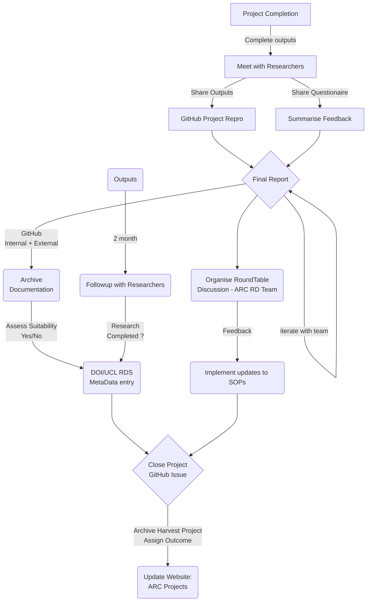

```ad-info
title:
# Standard Operating Procedure (SOP) for Project Completion
```

# Overview

This document contains information relevant to the procedures for closing of projects within the ARC Research Data team.


| For completion by the SOP Author   |   |
|---|---|
| Reference Number  | ARC/RDS/SOP/001   |
| Version  | V0.9 Sept 2023   |
| Document Author(s)  | Nicholas Owen  |
| Document Reviewer(s)  |   |


| For completion by Manager  |   |
|---|---|
| Name of ARC Team  | Research Data Stewards  |
| Issue Date  | 2023  |
| Implementation Date  | 2023   |
| Review Date  | 2024  |
| File location | Github.com/XXXXX |

All versions of this document can be found at the ARC Research Data teams repository *link*

If you are reading this SOP in a printed form, you are reading an uncontrolled document. Please verify the version number and date given as the most recent, cross-checking with the ARC teams GitHub site before proceeding.

The ARC Research Data team is committed to ensuring that, as far as reasonably practicable, the services and information provided are suitably open, and FAIR elements. This SOP has been assessed similarly.

## Contents
### 1. Introduction
### 2. Purpose
### 3. Scope
### 4. Abbreviations/Definitions
### 5. Process
### 6. Requirements
### 7. References/Associated Information
### 8. Version history

## 1. Introduction

## 2. Purpose

The overall purpose of this Standard Operating Procedure (SOP) is to provide guidance for managing and recording project information, ensuring appropriate collection, verification and analysis as needed in an appropriate manner to preserve information integrity, **FAIR**ness and auditing.
## 3. Scope

The information contained within this document should be used for all Research Data Team collaborative projects at UCL ARC.  Guidelines including the Research Governance Framework should also be adhered to.

In the event of working with controlled data, the team recognizes that it is not always possible or appropriate to record information and data in an open manner. In these circumstances, the team should ensure all governance is followed, whilst ensuring suitable anonymized metadata is recorded. Advice should be sought from both the research team and line manager to maintain correct governance.

## 4. Abbreviations/Definitions

| Abbreviation  | Definition|
|---|---|
| ARC  | Advanced Research Computing  |
| SOP  | Standard Operating Procedure  |
| FAIR | Findable, Accessible, Interoperable, Reusable |
| RDT  | Research Data Team  |
| ECT   | External Collaboration Team |

## 5. Process

### Outline
The diagram below outlines the main steps and requirements to be considered when completing a collaborative research project.



### 5.1 Details

Completion of a RDT collaborative project should include the following steps to ensure accurate recording of all information. This should include:
- All outputs have been delivered and all deliverables have been accepted by the client or stakeholders.
- A date for a meeting with the ECT to discuss findings and outputs. The meeting is an opportunity to get feedback from the researchers and to ensure that they are happy with the results.
- A feedback questionnaire should be shared with the researchers, to be summarised to improve the project's outputs and to inform future work. Update the ARC feedback summary `csv`: [research-software-development/scripts/notebooks/survey_results.csv at main · UCL-ARC/research-software-development (github.com)](https://github.com/UCL-ARC/research-software-development/blob/main/scripts/notebooks/survey_results.csv)
- Create a GitHub repository for the project on the UCL ARC organisation. The repository should contain all of the project's code, data, and documentation. This will make the project reproducible and accessible to others. All code should be fully documented in line with standard practices: such as [PEP 8 – Style Guide for Python Code | peps.python.org](https://peps.python.org/pep-0008/).  Standard naming conventions should be adhered to. 
- Write a completion report for the project. The report should summarise the project's findings, conclusions, and recommendations. It should also include the project's outputs and any feedback received. A copy of the final report should be also stored in the GitHub repository, UCL ARC secured.
- The completion report should be shared with the ARC team and amended as necessary until marked final.
- Schedule a Round table discussion at the ARC RDT meetings on a Tuesday to present the project, work involved and recommendations/insights gained. The discussion is an opportunity to get feedback from the team and to ensure that they are aligned with the project's outcomes.
- Discuss with the ECT the suitability of sharing the information only (as metadata) or outputs in the UCL RDR.
- Update this and other SOPs as necessary based upon the projects findings. This will help to ensure that the project's lessons learned are captured and shared with others.
- Close the project's GitHub issue. This will indicate that the project is complete and that all of the work has been done.
- Update the public-facing ARC webpage of projects: [Collaborative projects | Advanced Research Computing - UCL – University College London](https://www.ucl.ac.uk/advanced-research-computing/research/collaborative-projects)

- Follow up with the ECT in two months to see how they are using the project's outputs. This is an opportunity to get feedback on the outputs and to see if they met the researchers' needs. Discuss further outputs and opportunities.
- Write a case report for the UCL ARC website on the project and involvement of the RD team. Share on social media platforms as necessary.

### 6. Requirements

The team will notify individuals of SOP developments that may be relevant. Updates to SOPs will be shared through appropriate Slack channels and email. It is the responsibility of the research data team to ensure they read the issued updates that are relevant to them.

When a new SOP is authorised, or when an existing SOP is revised, all staff to which the SOP is relevant must ensure they have read and followed the documentation. 

Staff should take time to read and fully understand the SOP and relevant documents, ensuring that they are able to implement the SOP as required. If clarification is needed then approach the line manager who will clarify any outstanding information.

### 7. References/Associated Information

[]


### 8. Version History

This area should detail the version history for this document. It should detail the key elements of the changes to the versions.

| Version  | Date Implemented  | Details of Significant Changes  |
|---|---|---|
|   |   |   |
|   |   |   |
|   |   |   |
|   |   |   |
|   |   |   |
|   |   |   |
|   |   |   |
|   |   |   |
|   |   |   |
