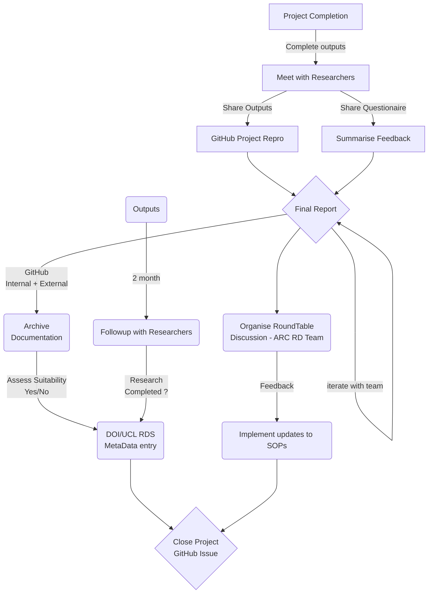
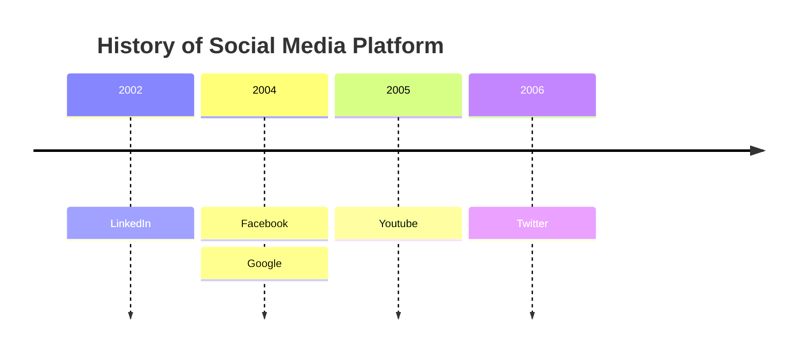

# SOP Project Living document

| For completion by the SOP Author   |   |
|---|---|
| Reference Number  | ARC/RDS/SOP/001   |
| Version  | V1.0 Sept 2023   |
| Document Author(s)  | Nicholas Owen  |
| Document Reviewer(s)  |   |

| For completion by XXXX  |   |
|---|---|
| Name of ARC Team  | Research Data Stewards  |
| Issue Date  | 2023  |
| Implementation Date  | 2023   |
| Review Date  | 2024  |
| File location | Github |

All versions of this document can be found at the ARC Research Data teams repository *link*

If you are reading this SOP in a printed form, you are reading an uncontrolled document. Please verify the version number and date given as the most recent, cross-checking with the ARC teams GitHub site before proceeding.

The ARC Research Data team is committed to ensuring that, as far as reasonably practicable, the services and information provided are suitably open, and FAIR elements. This SOP has been assessed similarly.

## Contents
### 1. Introduction
### 2. Purpose
### 3. Scope
### 4. Abbreviations/Definitions
### 5. Process
### 6. Requirements
### 7. References/Associated Information
### 8. Version history

## 1. Introduction

## 2. Purpose

The overall purpose of this Standard Operating Procedure (SOP) is to provide guidance for managing and recording project information, ensuring appropriate collection, verification and analysis as needed in an appropriate manner to preserve information integrity, FAIRness and auditing.
## 3. Scope

The information contained within this document should be used for all Research Data Team collaborative projects at UCL ARC.  Guidelines including the Research Governance Framework should also be adhered to.

In the event of working with controlled data, the team recognizes that it is not always possible or appropriate to record information and data in an open manner. In these circumstances, the team should ensure all governance is followed, whilst ensuring suitable anonymized metadata is recorded. Advice should be sought from both the research team and line manager to maintain correct governance.

## 4. Abbreviations/Definitions

| Abbreviation  | Definition|
|---|---|
| ARC  | Advanced Research Computing  |
| SOP  | Standard Operating Procedure  |
| FAIR | Findable, Accessible, Interoperable, Reusable |
| RDT  | Research Data Team  |
| ECT   | External Collaboration Team |

## 5. Process

### Outline
The diagram below outlines the main steps and requirements to be considered when completing a collaborative research project.

### 5.1 Details

Completion of a RDT collaborative project should include the following steps to ensure accurate recording of all information. This should include:
- Upon project output completion, an agreed date should be agreed upon with the ECT
- Feedback SOP form should be updated as necessary for the specific project and shared with all members of the ECT.
- 

exmaple
Timeline

