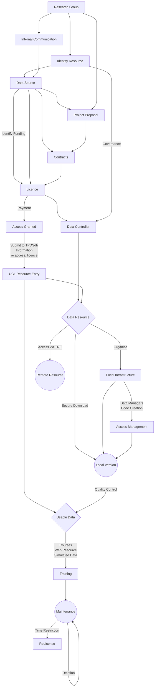

# Process Overview

```mermaid
flowchart TD
	A2[Research Group] ---> A1[Internal Communication]
	A2 ---> A[Identify Resource]
    A --> B[Data Source]
    A1 ---> B
    B ---> |Identify Funding| C
    B ---> C[Licence]
    B ---> B2[Project Proposal]
    B ---> B1[Contracts]
    A2 --->B2
    B1 ---> C
    B2 --->B1
    C ---> D[Data Controller]
    A ---> |Governance| D
	C ---> |Payment| F[Access Granted]
	F ---> |Submit to TPDSdb<br>Information<br>re access, licence|G[UCL Resource Entry]

	D ---> M{Data Resource} 
	G --->M
	M ---> |Organise| N[Local Intrastructure]
	M --->|Secure Download|O((Local Version))
	N ---> O
	M ---> |Access via TRE| P((Remote Resource))
	N ---> |Data Managers<br>Code Creation| Q[Access Management]
	Q ---> O
	G ---> R
	O ---> |Quality Control|R{Usable Data}
	
	R --->|Courses<br>Web Resource<br>Simulated Data|S[Training]
	S ---> T((Maintenance))
	T ---> |Licencing|T
	T ---> |Auditing|T
	T ---> |Deletion|T
	T -.-> |Time Restriction|U[ReLicense]

```

