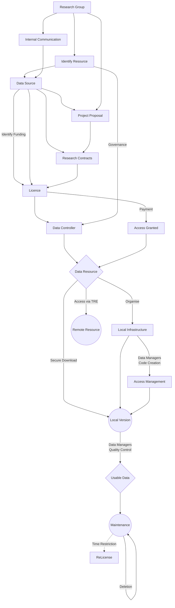

# Process Overview

```mermaid
flowchart TD
    A2[Research Group] ---> A1[Internal Communication]
    A2 ---> A[Identify Resource]
    A --> B[Data Source]
    A1 ---> B
    B ---> |Identify Funding| C
    B ---> C[Licence]
    B ---> B2[Project Proposal]
    B ---> B1[Research Contracts]
    A2 --->B2
    B1 ---> C
    B2 --->B1
    C ---> D[Data Controller]
    A ---> |Governance| D
    C ---> |Payment| F[Access Granted]    
    D ---> M{Data Resource}
    F ---> M
    M ---> |Organise| N[Local Infrastructure]
    M --->|Secure Download|O((Local Version))
    N ---> O
    M ---> |Access via TRE| P((Remote Resource))
    N ---> |Data Managers<br>Code Creation| Q[Access Management]
    Q ---> O    
    O ---> |Data Managers<br>Quality Control|R{Usable Data}    
    R ---> T((Maintenance))
    T ---> |Licencing|T
    T ---> |Governance|T
    T ---> |Linking|T
    T ---> |Exporting|T
    T ---> |Auditing|T
    T ---> |Deletion|T
    T -.-> |Time Restriction|U[ReLicense]

```

