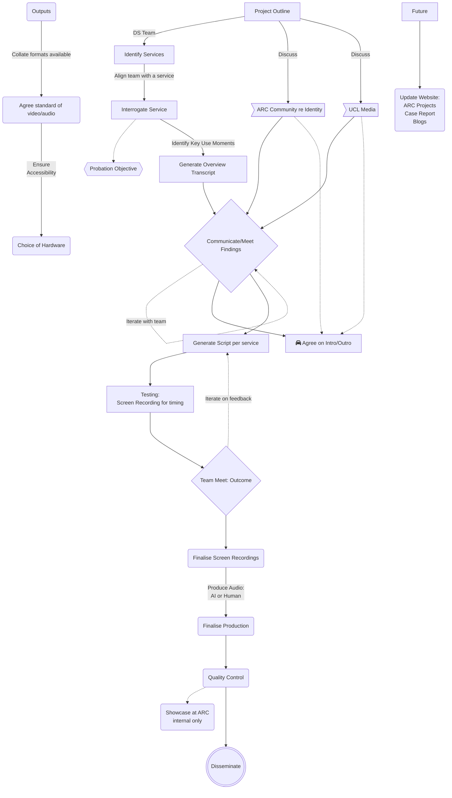

# ARC Service Promotional Videos Project

## General

To generate short (approx 10 minute) informational videos for each of the ARC services for use with new staff/students  to inform and encourage adoption.

## Overview

## Services Identified

| Service | Description |
|---|---|
|   |   |

## Team
| Name | Service assigned to |
|---|---|
|   |   |

## Misc
updated: `2023-10-20`
